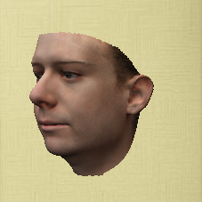
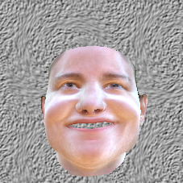
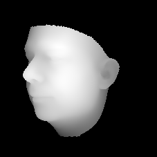
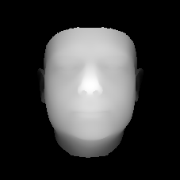
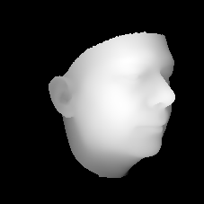
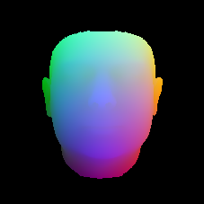

parametric-face-image-generator
===============================

This software enables you to generate fully parametric face images from the Basel Face Model 2017 as proposed in:

- [1] Adam Kortylewski, Andreas Schneider, Thomas Gerig, Bernhard Egger, Andreas Morel-Forster and Thomas Vetter 
["Training Deep Face Recognition Systems with Synthetic Data"](https://arxiv.org/abs/1802.05891), 
IN: arXiv preprint (2018)

- [2] Adam Kortylewski, Bernhard Egger, Andreas Schneider, Thomas Gerig, Andreas Morel-Forster and Thomas Vetter 
["Empirically Analyzing the Effect of Dataset Biases on Deep Face Recognition Systems"](https://arxiv.org/abs/1712.01619), 
IN: arXiv preprint (2017)

You can control the variation of parameters such as pose, shape, color, camera and illumination based on your demand and application.
This dataset can be used for training and comparing machine learning techniques such as CNNs on a common ground as proposed in [1] by generating fully controlled training and test data.

### Rendering Setup

 

 
Above you can see example face images sampled from this data generator. Each row shows different images of the same facial identity.

In the "controlled" setup (top row), the model parameters are sampled at equidistant positions along a certain parameter , e.g. the yaw pose.

In the "random" setup (bottom row), the model parameters are sampled randomly from a custom distribution.

### Rendering Different Image Modalities

You can render different image modalities such as e.g. depth images (top row), color coded correspondence images (bottom row), normals, albedo or illumination.

### Facial Landmarks

For each face image the location and visibilty of 19 facial landmarks is written in a .tlms file in the following format:

"facial landmark name" "visibility" "x-position" "y-position"   
 
Usage
-----

### Setup
- installed [Java](http://www.oracle.com/technetwork/java/javase/downloads/index.html) (Version 8.0 or higher recommended)
- download jar and config file under `release`
- [download](http://gravis.dmi.unibas.ch/PMM/) Basel Face Model 2017
- [download](http://gravis.dmi.unibas.ch/PMM/)  Basel Illumination Prior 2017
- get a dataset with backgrounds, e.g. the [Describable Textures Dataset](http://www.robots.ox.ac.uk/~vgg/data/dtd/)

### Run
- adapt paths and configuration in data/config_files/example_config_controlled.json
- For generating images in the controlled setup execute:
 - java -Xmx2g -cp generator.jar faces.apps.ControlledFaces -c data/config_files/example_config_controlled.json
- For generating images in the random setup execute:
 - java -Xmx2g -cp generator.jar faces.apps.RandomFaces -c data/config_files/example_config_random.json

### For Developers:
- installed [Java](http://www.oracle.com/technetwork/java/javase/downloads/index.html) (Version 8.0 or higher recommended)
- installed [sbt](http://www.scala-sbt.org/release/tutorial/Setup.html) (only for compiling from sources)
- clone repository
- compile and run using `sbt run -mem 2000`

### Singularity:
- we provide a singularity container recipe file to run the data generator directly on compute servers

Hepl needed
-----------
There is a [scalismo-faces google group](https://groups.google.com/forum/#!forum/scalismo-faces) for general questions and discussion.

Background
----------
Besides the publications listed next, we have also freely available [lectures and tutorials](http://gravis.dmi.unibas.ch/PMM/lectures/overview/). Some of the topics covered are statistical shape modeling and model-based image analysis as part of our research about [Probabilistic Morphable Models](http://gravis.dmi.unibas.ch/PMM/).

Publications
------------
If you use this software you will need the Basel Face Model 2017, the Basel Illumination Prior 2017 and a dataset of backgrounds. Please cite the following papers:

### Data Generator - Random Mode
- [1] Adam Kortylewski, Andreas Schneider, Thomas Gerig, Bernhard Egger, Andreas Morel-Forster and Thomas Vetter 
["Training Deep Face Recognition Systems with Synthetic Data"](https://arxiv.org/abs/1802.05891), 
IN: arXiv preprint (2018)

### Data Generator - Controlled Mode
- [2] Adam Kortylewski, Bernhard Egger, Andreas Schneider, Thomas Gerig, Andreas Morel-Forster and Thomas Vetter 
["Empirically Analyzing the Effect of Dataset Biases on Deep Face Recognition Systems"](https://arxiv.org/abs/1712.01619), 
IN: arXiv preprint (2017)

### Basel Face Model 2017
- [3] Thomas Gerig, Andreas Morel-Forster, Clemens Blumer, Bernhard Egger, Marcel Luethi, Sandro Schoenborn and Thomas Vetter 
[" Morphable Face Models - An Open Framework"](https://arxiv.org/abs/1709.08398), 
IN: arXiv preprint (2017)

### Basel Illumination Prior 2017
- [4] Bernhard Egger, Sandro Schoenborn, Andreas Schneider, Adam Kortylewski, Andreas Morel-Forster, Clemens Blumer and Thomas Vetter 
["Occlusion-aware 3D Morphable Models and an Illumination Prior for Face Image Analysis"](http://gravis.dmi.unibas.ch/publications/2018/2018_Egger_IJCV.pdf),
IN: International Journal of Computer Vision, 2018 

### Background Dataset
- A background dataset of your choice

Contributors
------------

- Bernhard Egger
- Adam Kortylewski
- Andreas Morel-Forster
- Andreas Schneider

Maintainers
-----------

- University of Basel, Graphics and Vision research: [@unibas-gravis](https://github.com/unibas-gravis), [homepage](http://gravis.cs.unibas.ch)

License
-------

[Apache License, Version 2.0](https://www.apache.org/licenses/LICENSE-2.0), details see LICENSE

    Copyright 2017, University of Basel, Graphics and Vision Research

    Licensed under the Apache License, Version 2.0 (the "License");
    you may not use this file except in compliance with the License.
    You may obtain a copy of the License at

        http://www.apache.org/licenses/LICENSE-2.0

    Unless required by applicable law or agreed to in writing, software
    distributed under the License is distributed on an "AS IS" BASIS,
    WITHOUT WARRANTIES OR CONDITIONS OF ANY KIND, either express or implied.
    See the License for the specific language governing permissions and
    limitations under the License.

