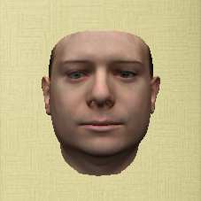
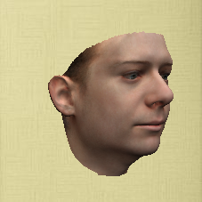
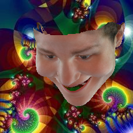
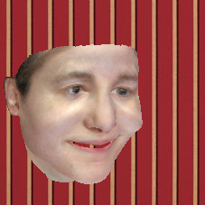

parametric-face-image-generator
===============================

This software enables you to generate fully parametric face images from the Basel Face Model 2017 as proposed in:

- Adam Kortylewski, Bernhard Egger, Andreas Schneider, Thomas Gerig, Andreas Morel-Forster and Thomas Vetter 
[[1] " Empirically Analyzing the Effect of Dataset Biases on Deep Face Recognition Systems"](https://arxiv.org/abs/1712.01619), 
IN: arXiv preprint (2017)

You can control the variation of parameters such as pose, shape, color, camera and illumination based on your demand and application.
This dataset can be used for training and comparing machine learning techniques such as SVMs, CNNs or Capsule Networks on a common ground as proposed in [1] by generating fully controlled training and test data.

 

 
Above you can see example face images sampled from this data generator. Each row shows different images of the same face identity.

The top row illustrates images for which the model parameters were sampled at equidistant positions along a certain parameter  - in this case, the yaw pose. We refer to this setup as "controlled".

The images in the bottom row are generated by randomly sampling from the model parameters. We refer to this setup as "random".

Usage
-----

### Setup
- installed [Java](http://www.oracle.com/technetwork/java/javase/downloads/index.html) (Version 8.0 or higher recommended)
- download jar and config file under `release`
- [download](http://gravis.dmi.unibas.ch/PMM/) Basel Face Model 2017
- (optional) [request](bernhard.egger@unibas.ch) Basel Illumination Prior 2017
- get a dataset with backgrounds, e.g. the [Describable Textures Dataset](http://www.robots.ox.ac.uk/~vgg/data/dtd/)

### Run
- adapt paths and configuration in data/config_files/example_config_controlled.json
- For generating images in the controlled setup execute:
 - java -Xmx2g -cp generator.jar faces.apps.ControlledFaces -c data/config_files/example_config_controlled.json
- For generating images in the random setup execute:
 - java -Xmx2g -cp generator.jar faces.apps.RandomFaces -c data/config_files/example_config_random.json

### For Developers:
- installed [Java](http://www.oracle.com/technetwork/java/javase/downloads/index.html) (Version 8.0 or higher recommended)
- installed [sbt](http://www.scala-sbt.org/release/tutorial/Setup.html) (only for compiling from sources)
- clone repository
- compile and run using `sbt run -mem 2000`

Publications
------------
If you use this software you will need the Basel Face Model 2017, the Basel Illumination Prior 2017 and a dataset of backgrounds. Please cite the following papers:

### Data Generator
- [1] Adam Kortylewski, Bernhard Egger, Andreas Schneider, Thomas Gerig, Andreas Morel-Forster and Thomas Vetter 
["Empirically Analyzing the Effect of Dataset Biases on Deep Face Recognition Systems"](https://arxiv.org/abs/1712.01619), 
IN: arXiv preprint (2017)

### Basel Face Model 2017
- [2] Thomas Gerig, Andreas Morel-Forster, Clemens Blumer, Bernhard Egger, Marcel Luethi, Sandro Schoenborn and Thomas Vetter 
[" Morphable Face Models - An Open Framework"](https://arxiv.org/abs/1709.08398), 
IN: arXiv preprint (2017)

### Basel Illumination Prior 2017
- [3] Bernhard Egger, Sandro Schoenborn, Andreas Schneider, Adam Kortylewski, Andreas Morel-Forster, Clemens Blumer and Thomas Vetter 
 Occlusion-aware 3D Morphable Models and an Illumination Prior for Face Image Analysis,
IN: to appear

### Background Dataset
- A background dataset of your choice

Contributors
------------

- Bernhard Egger
- Adam Kortylewski
- Andreas Morel-Forster

Maintainers
-----------

- University of Basel, Graphics and Vision research: [@unibas-gravis](https://github.com/unibas-gravis), [homepage](http://gravis.cs.unibas.ch)

License
-------

[Apache License, Version 2.0](https://www.apache.org/licenses/LICENSE-2.0), details see LICENSE

    Copyright 2017, University of Basel, Graphics and Vision Research

    Licensed under the Apache License, Version 2.0 (the "License");
    you may not use this file except in compliance with the License.
    You may obtain a copy of the License at

        http://www.apache.org/licenses/LICENSE-2.0

    Unless required by applicable law or agreed to in writing, software
    distributed under the License is distributed on an "AS IS" BASIS,
    WITHOUT WARRANTIES OR CONDITIONS OF ANY KIND, either express or implied.
    See the License for the specific language governing permissions and
    limitations under the License.

